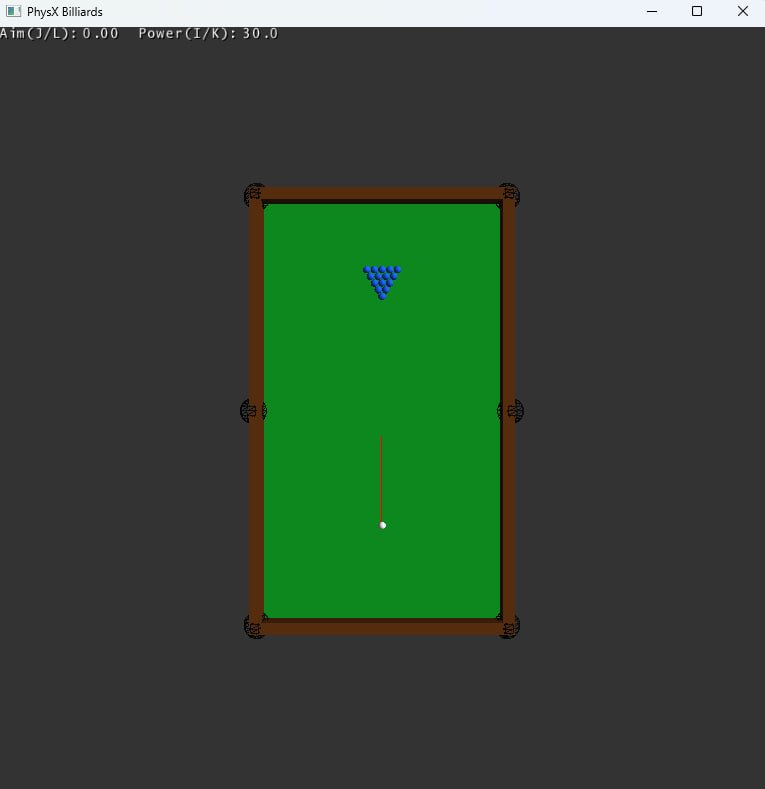

### Описание
Программа реализует упрощённую игру в бильярд на базе NVIDIA PhysX и Omniverse Snippets Renderer.

На сцене создаются:

- стол (плоскость) и 4 борта (статические боксы),
- 16 шаров (динамические сферы): 15 шаров пирамидой у одного конца стола и биток у другого,
- 6 “лунок” без реальных отверстий — они реализованы как trigger-зоны (сферы-триггеры), расположенные в углах и в центре длинных бортов.

Физика (движение, столкновения, отскоки) рассчитывается PhysX, отрисовка выполняется через Snippets.

### Управление
- J / L — изменить угол удара (поворот направления в плоскости стола).
- I / K — увеличить/уменьшить силу удара.
- Space — ударить биток: к битку прикладывается импульс в выбранном направлении (строго параллельно столу).
- R — перезапуск: заново создаётся расстановка шаров (и сбрасывается состояние игры).
- U / O — приближение/отдаление камеры (изменяет высоту/отъезд).

### Логика “лунок” и удаление шаров
Лунки реализованы через PxShape с флагом eTRIGGER_SHAPE. Они не участвуют в обычных столкновениях, но генерируют события, когда шар входит в область триггера.
- В CustomEventCallback::onTrigger при первом касании триггера шар помечается как “забитый” (pocketed = true) и добавляется в очередь removedActors.
- В renderCallback после шага симуляции (simulate/fetchResults) очередь обрабатывается: соответствующие шары удаляются из сцены (scene->removeActor) и освобождаются (release).

### Победа / поражение
- Поражение: если “забит” биток (isCue == true), игра заканчивается (gameOver = true).
- Победа: если все 15 шаров (кроме битка) забиты, игра заканчивается с победой (winGame = true).
- После завершения игры можно нажать R для рестарта.

### Камера и отрисовка прицела
Камера фиксируется каждый кадр: вычисляется позиция камеры и направление взгляда на центр стола. Также рисуется “прицел” — красная линия направления удара от центра битка (Snippets::DrawLine).

### Пример работы

