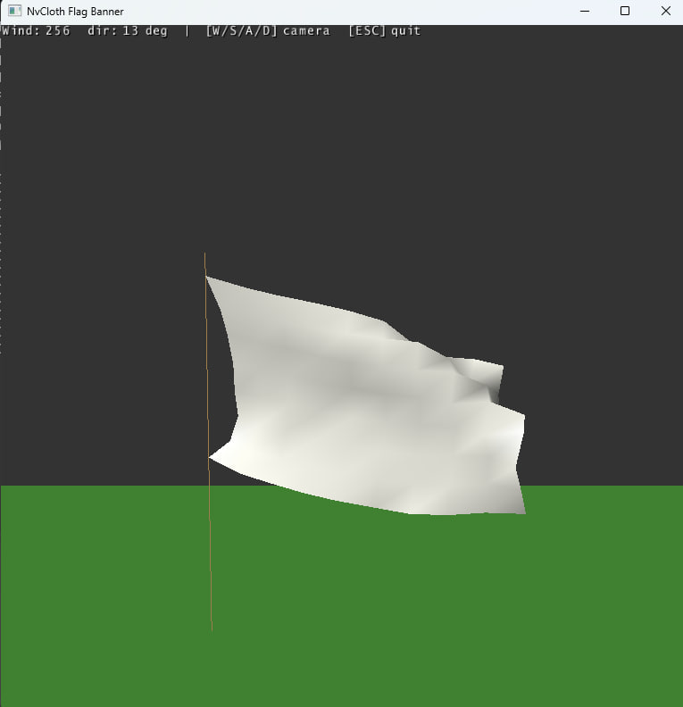

### Описание
Программа реализует симуляцию ткани (баннер-флаг) на базе NVIDIA NvCloth и Omniverse Snippets Renderer.

На сцене создаются:

- зелёная плоскость земли (визуальная + коллизия для ткани)
- флагшток (вертикальная стойка вдоль закреплённого левого края)
- прямоугольный белый флаг 3×2 м, сетка 10×8 = **80 вершин** (126 треугольников)

Физика ткани (растяжение, изгиб, сдвиг, гравитация, ветер, столкновение с землёй) рассчитывается NvCloth CPU-солвером, отрисовка выполняется через Snippets.

### Управление
- W / S / A / D — свободное перемещение камеры.
- ESC — выход.

### Флаг и закрепление
Флаг — вертикальная сетка частиц, верхний край расположен на высоте 4 м. Углы обозначены **ABCD** от левого нижнего (A — нижний левый, B — верхний левый, C — верхний правый, D — нижний правый). Закреплены **два левых угла A и B** (левый край у флагштока):

- B (верхний левый) — `particle[0]`, `(0, 4, 0)`
- A (нижний левый) — `particle[70]`, `(0, 2, 0)`

Закрепление задаётся через `inverse mass = 0` (компонента `w` в `PxVec4`). Остальные 78 частиц имеют суммарную массу ~1 кг.

### Fabric и constraint'ы
Fabric собирается вручную (без NvClothExt cooker): горизонтальные, вертикальные, диагональные (shear) и bending-связи между соседними вершинами. Constraint'ы разбиты на **14 set'ов** с graph-colouring — внутри одного set'а ни одна частица не участвует в двух связях одновременно, что требуется AVX-солверу NvCloth. Каждый set дополнительно дополняется до кратности 8 фиктивными constraint'ами между закреплёнными углами.

Жёсткость задаётся через `PhaseConfig` (stiffness = 0.8, stretch limit = 1.05). Частота солвера — 120 Гц (~2 итерации за кадр при 60 FPS).

### Ветер
Направление и сила ветра меняются со временем:

- **сила**: 100–300 (`200 + 100·sin(t)` — при 300 флаг натянут, при 100 заметно провисает)
- **азимут** (угол на HUD): направление ветра в горизонтальной плоскости XZ, отсчёт от оси +X (0° — вдоль +X, 90° — вдоль +Z); угол медленно меняется со временем

Ветер действует на треугольники fabric'а через `setWindVelocity`, drag = 0.022, lift = 0.012. На экране: **Wind** — модуль вектора ветра (единицы NvCloth, диапазон 100–300), **azimuth** — угол направления в плоскости земли (0° = ось +X).

### Коллизия с землёй
Для ткани задана плоскость `y = 0` (`setPlanes` + `setConvexes`), чтобы флаг не проваливался сквозь пол при раскачивании.

### Камера
Начальная позиция — перед центром флага (смещение ~6.5 м по оси Z). Камера управляется стандартным обработчиком Snippets.

### Отладочные логи
При запуске в консоль выводятся начальные позиции закреплённых углов и свободной частицы. Во время симуляции каждые 60 кадров печатается позиция `particle[5]`; при появлении NaN выводится сообщение об ошибке.

### Пример работы

